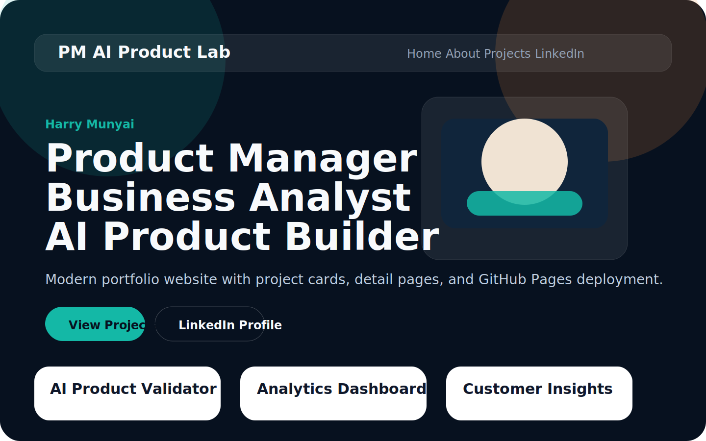
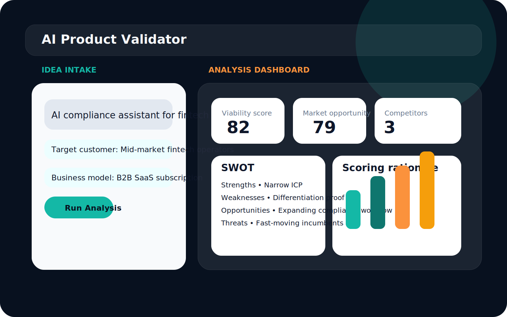
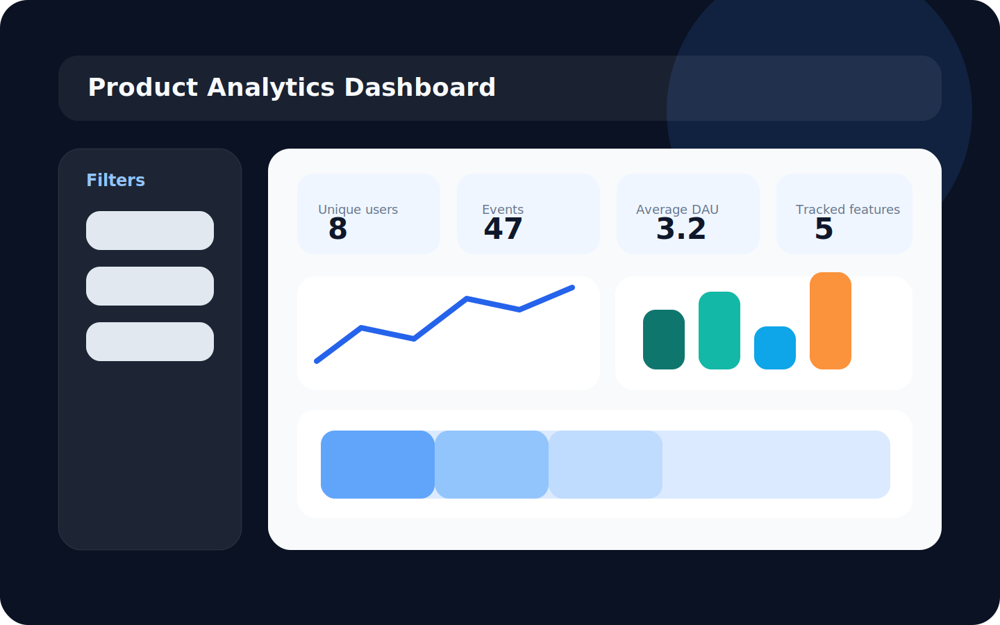

# pm-ai-product-lab
<<<<<<< HEAD

`pm-ai-product-lab` is a portfolio repository and static GitHub Pages site for Harry Munyai, built to showcase product thinking, analytics fluency, AI experimentation, and lightweight ML delivery.

It combines two surfaces in one repository:

- a production-style collection of runnable Streamlit projects
- a modern portfolio website designed for public sharing on GitHub and LinkedIn

## Live Portfolio

Expected GitHub Pages URL:

`https://USERNAME.github.io/pm-ai-product-lab`

Replace `USERNAME` with your GitHub username and `YOUR_LINKEDIN_URL` in the website source before publishing.

## Portfolio Preview







## Repository Overview

### Portfolio Website

The static site lives at the repository root and includes:

- [index.html](index.html)
- [project.html](project.html)
- [style.css](style.css)
- [script.js](script.js)
- [assets/](assets/)

### Working Projects

| Project | Folder | Focus | Local run command |
| --- | --- | --- | --- |
| AI Product Validator | `projects/ai-product-validator` | Startup idea evaluation, SWOT, market scoring | `streamlit run app.py` |
| Product Analytics Dashboard | `projects/product-analytics-dashboard` | DAU, funnels, retention, feature adoption | `streamlit run app.py` |
| AI Customer Insights | `projects/ai-customer-insights` | Ticket analysis, sentiment, issue classification | `streamlit run app.py` |
| Product A/B Testing Engine | `projects/product-ab-testing-engine` | Experiment setup, uplift analysis, stats testing | `streamlit run app.py` |
| AI Sports Predictor | `projects/sports-ai-predictor` | Match outcome prediction and win probability | `streamlit run app.py` |
| AI Product Roadmap Generator | `projects/ai-product-roadmap-generator` | Prioritization, impact vs effort, quarterly roadmap | `streamlit run app.py` |
| Product Teardowns | `product-teardowns` | Product teardown library and portfolio browser | `streamlit run app.py` |

## Technology Stack

### Application stack

- Python
- Streamlit
- Pandas
- Plotly
- scikit-learn
- SQLite
- OpenAI API

### Website stack

- HTML
- CSS
- JavaScript
- GitHub Pages

## Repository Structure

```text
pm-ai-product-lab/
├── README.md
├── index.html
├── project.html
├── style.css
├── script.js
├── requirements.txt
├── assets/
│   ├── profile.jpg
│   ├── profile-source.svg
│   └── project_images/
├── docs/
│   ├── architecture.md
│   └── product-philosophy.md
├── product-teardowns/
└── projects/
    ├── ai-product-validator/
    ├── product-analytics-dashboard/
    ├── ai-customer-insights/
    ├── product-ab-testing-engine/
    ├── sports-ai-predictor/
    └── ai-product-roadmap-generator/
```

## Quick Start

Create and activate a Python virtual environment, then install the shared dependencies:

```bash
python3 -m venv .venv
source .venv/bin/activate
pip install -r requirements.txt
```

Optional for AI summaries:

```bash
export OPENAI_API_KEY=your_key_here
```

The AI-enabled apps still run without an API key because they fall back to deterministic local logic.

## Running the Projects Locally

Every project runs independently with the same flow:

```bash
cd projects/ai-product-validator
pip install -r requirements.txt
streamlit run app.py
```

Use the same pattern for:

- `projects/product-analytics-dashboard`
- `projects/ai-customer-insights`
- `projects/product-ab-testing-engine`
- `projects/sports-ai-predictor`
- `projects/ai-product-roadmap-generator`
- `product-teardowns`

## Sample Datasets

Each app auto-loads bundled data on launch:

- `projects/ai-product-validator/data/sample_ideas.csv`
- `projects/product-analytics-dashboard/data/sample_events.csv`
- `projects/ai-customer-insights/data/sample_tickets.csv`
- `projects/product-ab-testing-engine/data/sample_experiment_results.csv`
- `projects/sports-ai-predictor/data/sample_matches.csv`
- `projects/ai-product-roadmap-generator/data/sample_feature_ideas.csv`
- `product-teardowns/data/teardown_catalog.csv`

## Project Highlights

### AI Product Validator

- Evaluates product ideas from product idea, target customer, and business model inputs
- Generates SWOT analysis, viability scoring, market opportunity scoring, and competitor suggestions
- Saves generated reports in SQLite

### Product Analytics Dashboard

- Uploads event CSVs or uses the built-in sample dataset
- Calculates daily active users, sequential funnel conversion, retention cohorts, and feature adoption
- Uses Plotly for exploratory PM-style analysis

### AI Customer Insights

- Classifies support tickets into issue themes
- Scores sentiment and flags feature requests and bug reports
- Surfaces issue frequency, sentiment trend, bug trend, and feature-request trend

### Product A/B Testing Engine

- Stores experiment definitions in SQLite
- Supports control and variant setup
- Calculates conversion rate, uplift, z-score, p-value, confidence intervals, and segment performance

### AI Sports Predictor

- Trains a scikit-learn logistic regression model on match data
- Predicts match outcome probabilities
- Shows feature importance, confusion matrix, and team performance trends

### AI Product Roadmap Generator

- Uses goals, feedback, metrics, and feature ideas as inputs
- Produces prioritized features, an impact vs effort view, and a quarterly roadmap
- Adds optional AI-generated planning narrative

### Product Teardowns

- Includes teardown documents for Netflix, Uber, Airbnb, Stripe, and OpenAI
- Provides a Streamlit browser with metadata and markdown content

## GitHub Pages Deployment

The repository includes [deploy-pages.yml](.github/workflows/deploy-pages.yml) for automatic deployment.

### Enable GitHub Pages

1. Push the repository to GitHub on the `main` branch.
2. Go to `Settings` -> `Pages`.
3. Under `Build and deployment`, select `GitHub Actions`.
4. Ensure the workflow has permission to deploy Pages.
5. Update `YOUR_LINKEDIN_URL` in [index.html](index.html) and [project.html](project.html).
6. After the workflow completes, the site will publish to `https://USERNAME.github.io/pm-ai-product-lab`.

## Documentation

- [Architecture](docs/architecture.md)
- [Product Philosophy](docs/product-philosophy.md)

## Verification

Syntax validation can be run with:

```bash
env PYTHONPYCACHEPREFIX=/tmp/pycache python3 -m compileall -q .
```
=======
pm-ai-product-lab │ ├ ai-product-validator ├ product-analytics-dashboard ├ ai-customer-insights ├ product-ab-testing-engine ├ sports-ai-predictor ├ ai-product-roadmap-generator └ product-teardowns
>>>>>>> 4167ef506e84a0e740101f46b1eee0d3eb8f9d89
