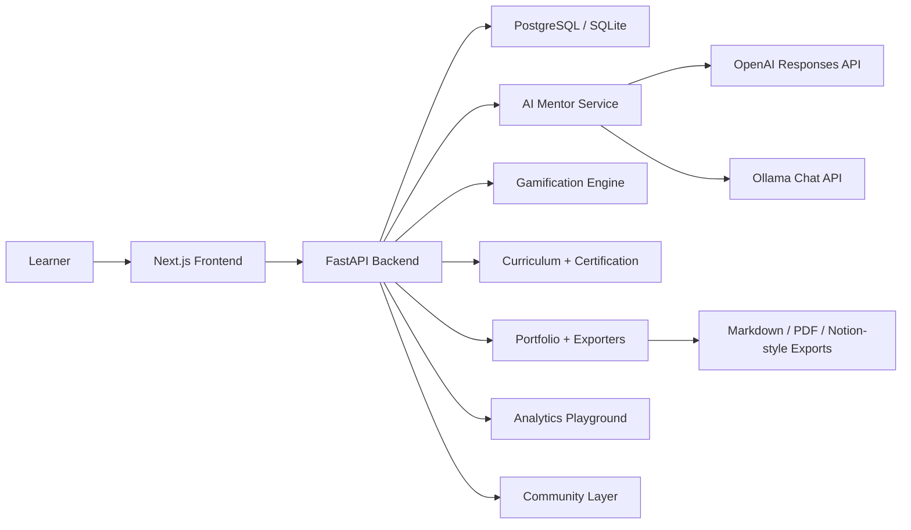

# PM90 Architecture

## System diagram

## Runtime responsibilities

- `frontend/`: Next.js App Router experience for auth, dashboard, curriculum, mentor, simulations, artifacts, analytics, community, and resources.
- `backend/app/routers`: REST API for auth, daily progression, mentor interactions, simulations, artifacts, analytics, and community.
- `backend/app/services/gamification.py`: XP, streaks, badge logic, leaderboard ranking, and progressive skill-tree unlocking.
- `backend/app/services/certification.py`: PM90 graduation checks and certificate artifact issuance.
- `backend/app/services/ai.py`: Provider abstraction for OpenAI, Ollama, and deterministic fallback responses.
- `backend/app/services/exporters.py`: Markdown, PDF, and Notion-style artifact export generation.
- `backend/app/seed.py`: 90-day curriculum seed, simulations, weekly challenges, resources, and demo data.

## Core data model

- `users`: learner profile, XP balance, level, and auth identity.
- `day_content`: the canonical 90-day curriculum.
- `daily_progress`: lesson completions, reflections, challenge answers, and scores.
- `user_badges`: unlocked achievements.
- `artifacts`: PRDs, roadmaps, personas, north-star briefs, case studies, and certificates.
- `discussion_posts`: community discussion threads.
- `simulation_attempts`: scenario submissions and mentor feedback.

## Request flow

1. The frontend authenticates the learner and stores the bearer token locally.
2. Curriculum and dashboard calls hit FastAPI endpoints under `/api/...`.
3. The backend loads the learner state from the database, computes progression and gamification state, and issues AI or export work when needed.
4. The AI service routes requests to OpenAI, Ollama, or the fallback responder based on env configuration.
5. Certification is issued automatically once all 90 days are complete.
